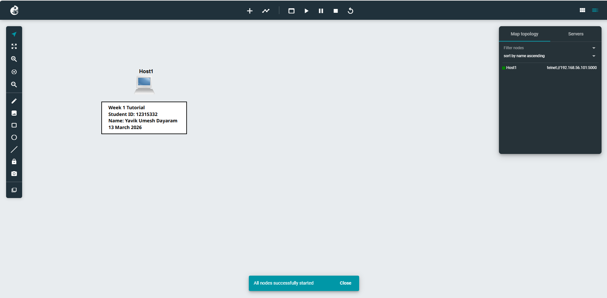

# Week 01 Portfolio – GNS3 Introduction

**Unit:** COIT20261 – Network Security  
**Student Name:** Yavik Umesh Dayaram  
**Student ID:** 12315332  
**Date:** 13 March 2026  

---

# 1. Overview

This tutorial introduced the basic use of **GNS3** to simulate a simple network environment.  
The task focused on creating a network project, adding a Linux host node, configuring a static IP address, and verifying the configuration using Linux commands.

The exercise also demonstrated how screenshots and documentation can be used to record networking experiments and upload them to a GitHub portfolio repository.

---

# 2. Software Used

The following software tools were used during the tutorial:

- **VirtualBox** – used to support virtual machines required by GNS3  
- **GNS3** – used to create and simulate the network topology  
- **GitHub** – used to store and manage the portfolio files

A private GitHub repository was created with the required format:

12351332-COIT20261-2026T1

This repository stores the documentation and screenshots for the weekly portfolio tasks.

---

# 3. Creating the GNS3 Project

A new GNS3 project was created with the following name:

GNS3-Intro-StudentID

Steps performed:

1. Opened the GNS3 application.
2. Selected **New Project**.
3. Entered the project name.
4. Opened the project workspace where the network topology would be built.

---

# 4. Adding the Linux Host

A **Linux Host** device was added to the topology.

Steps performed:

1. Selected **Linux Host** from the device list.
2. Dragged the device to the workspace.
3. Renamed the device to **Host1**.

This host represents a basic Linux machine that can be configured with networking settings.

---

# 5. Adding Annotations

Annotations were used to document the network diagram.

A text annotation was added containing:

Week 1 Tutorial
Student ID: 12315332
Name: Yavik Umesh Dayaram
13 March 2026

A rectangle shape was placed around the text to highlight the information within the topology.

---

# 6. Static IP Configuration

The network configuration for the Linux host was modified by editing the following configuration file:

/etc/network/interfaces

The interface **eth0** was configured with a static IP address.

'''bash 
auto eth0
iface eth0 inet static
    address 10.10.0.2
    netmask 255.255.255.0 ''' 

Explanation

auto eth0
Automatically activates the interface when the system starts.

iface eth0 inet static
Specifies that the interface uses a static IPv4 address.

address 10.10.0.2
Assigns the IP address to the host.

netmask 255.255.255.0
Defines the subnet mask.

# 7. Starting the Node

After configuring the interface:

The Host1 node was started.

A web console was opened from GNS3.

The Linux terminal became accessible.

# 8. Verifying the IP Address

The following command was executed in the console to verify the configuration:

ip addr show

The output displayed the network interface and confirmed the IP address assignment:

eth0
inet 10.10.0.2/24

This confirmed that the static IP address was successfully configured.

# 9. Screenshots

The following screenshots were captured during the tutorial.

## 9.1 Network Topology

This screenshot shows the GNS3 workspace containing the Host1 node and the tutorial annotation.

## 9.2 Network Configuration Window

This screenshot shows the configuration of the eth0 interface where the static IP address 10.10.0.2 was assigned.

## 9.3 Linux Console Input

This screenshot shows the Input of the command used to verify the network configuration.

# 10. What I Learned

This tutorial helped develop several important networking skills.

Understanding GNS3

GNS3 is a network simulation platform that allows users to design and test network configurations in a virtual environment.

Static IP Configuration

A static IP address can be manually assigned to a network interface through the /etc/network/interfaces file. This ensures that the host always uses the same IP address.

Linux Networking Commands

The command:

ip addr show

is used to display network interfaces and their IP addresses.

Network Interfaces

Linux identifies network connections using interface names such as eth0.

# 11. Conclusion

This tutorial provided an introduction to network simulation using GNS3 and basic Linux networking configuration. By creating a simple network topology and assigning a static IP address to a Linux host, the exercise demonstrated how virtual network environments can be built and verified.

These fundamental skills will support more advanced networking and cybersecurity exercises throughout the unit.

