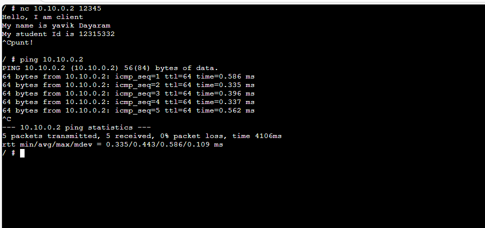
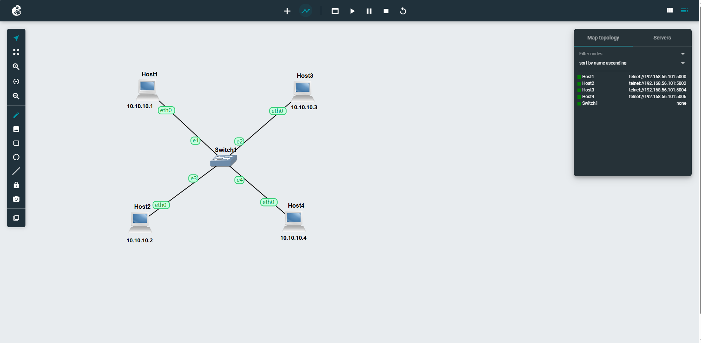

# Week 03 Tutorial – Netcat and Packet Capture

---

# Task 1: Simple Application Communication with Netcat

## Aim

To learn how to use Netcat (`nc`) to establish simple client-server communication between two hosts.

---

## Network Setup

The network consists of:

* 4 Linux hosts (Host1, Host2, Host3, Host4)
* 1 Ethernet switch
* All hosts are configured in the same subnet (10.1.1.0/24)

---

## Steps Performed

### 1. Start Netcat Server (Host2)

```bash
nc -l -p 12345
```

### 2. Start Netcat Client (Host1)

```bash
nc 10.1.1.2 12345
```

---

## Communication Output

### Client (Host1)

```bash
nc 10.1.1.2 12345
Yavik Dayaram
12315332
```

### Server (Host2)

```bash
nc -l -p 12345
Yavik Dayaram
12315332
```

---

## Result

* Successful communication was established between client and server.
* Messages were exchanged in both directions.
* The client sent the **name**, and the server sent the **student ID**.

---

## Screenshot


---

# Task 2: Capturing Packets

## Aim

To capture packets transmitted between hosts and export the capture file.

---

## Steps Performed

### 1. Start Packet Capture

* Right-click on the link between **Host1 and Switch**
* Select **Start Capture**
* File name:


---

### 2. Ping Test (Host1 → Host2)

```bash
ping -c 3 10.1.1.2
```

---

### 3. Netcat Communication (Host1 → Host3)

#### On Host3 (Server):

```bash
nc -l -p 12345
```

#### On Host1 (Client):

```bash
nc 10.1.1.3 12345
```

#### Message Sent:

```bash
Yavik Dayaram
```

---

### 4. Stop Capture

* Right-click the link → **Stop Capture**

---

### 5. Transfer Capture File

The capture file was retrieved from the GNS3 VM using **FileZilla**.

#### Connection Details:

* Protocol: SFTP
* Host: GNS3 VM IP
* Username: gns3
* Password: gns3

#### File Location:

```
/opt/gns3/projects/<project-id>/project-files/captures/
```

---

## Output File


---

## Result

* Successfully captured network traffic including:

  * ICMP packets (Ping)
  * TCP packets (Netcat communication)
* The `.pcap` file was exported and can be opened in Wireshark for analysis.

---

# Conclusion

In this tutorial:

* Netcat was used to establish simple client-server communication.
* Packet capture was performed on a network link.
* Network traffic was successfully exported for further analysis.

---

# Files Submitted




