# Week 04 Tutorial – Routing & OSPF  
---

# Task 1: View Routing Tables

## Aim
Learn how to view routing tables and enable forwarding on a router.

---

## Network Topology

- 3 × Linux Hosts (Host1, Host2, Host3)  
- 1 × Linux Router (Router1)  
- 1 × Ethernet Switch  

Two subnets were created:

- Subnet A: `10.10.1.0/24`  
- Subnet B: `10.10.2.0/24`  
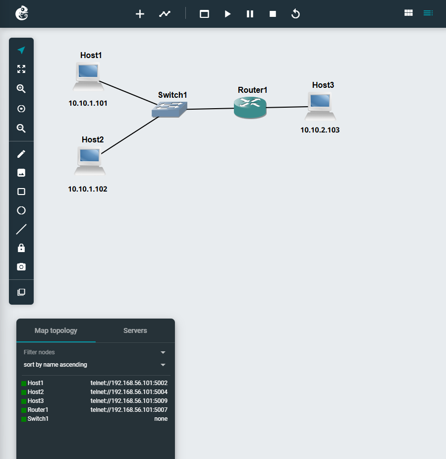
---

## IP Address Configuration

| Device   | Interface | IP Address | Netmask       | Gateway     |
|----------|----------|------------|---------------|------------|
| Host1    | eth0     | 10.10.1.101   | 255.255.255.0 | 10.10.1.1   |
| Host2    | eth0     | 10.10.1.102   | 255.255.255.0 | 10.10.1.1   |
| Router1  | eth0     | 10.10.1.1   | 255.255.255.0 | -          |
| Router1  | eth1     | 10.10.2.1   | 255.255.255.0 | -          |
| Host3    | eth0     | 10.10.2.103  | 255.255.255.0 | 10.10.2.1   |

---

## Forwarding Configuration

### Router
```bash
sysctl net.ipv4.ip_forward=1
```
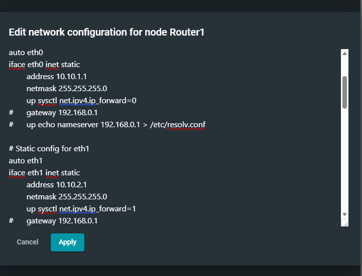

## Hosts
```bash
sysctl net.ipv4.ip_forward=0
```
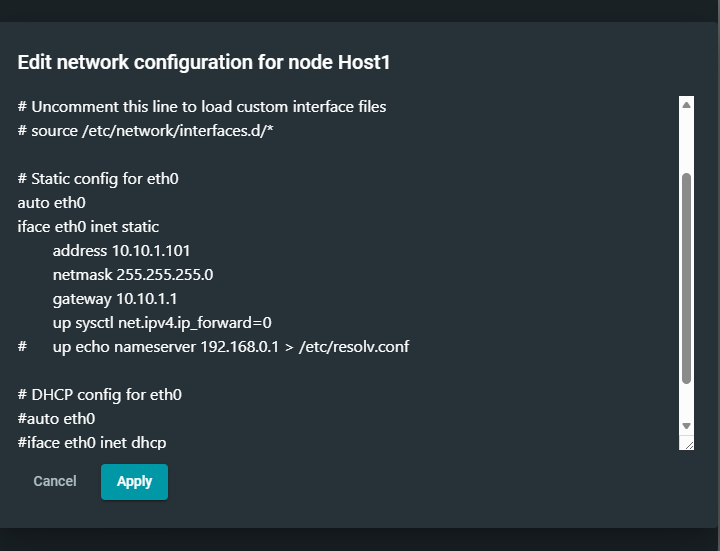
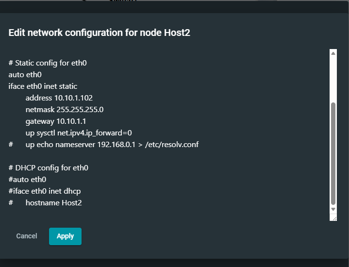
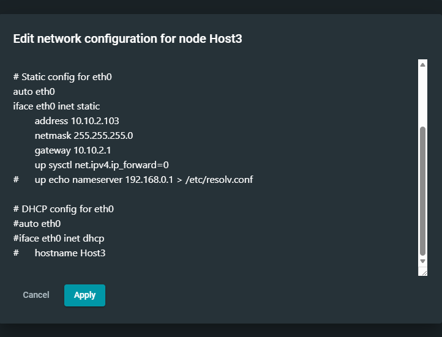


## Routing Tables
### Host1

ip route show

default via 10.10.1.1 dev eth0
10.10.1.0/24 dev eth0 proto kernel scope link src 10.10.1.101
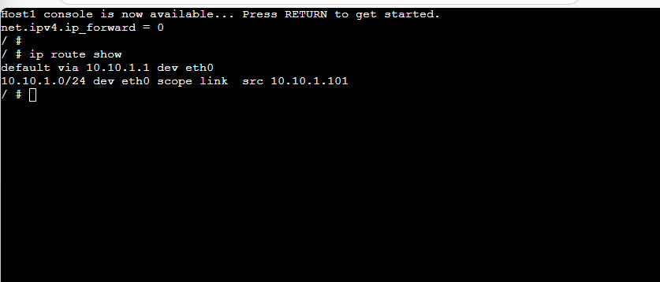

### Host3

ip route show

default via 10.10.2.1 dev eth0
10.10.2.0/24 dev eth0 proto kernel scope link src 10.10.2.103

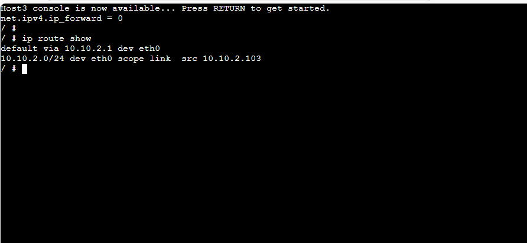

### Router1

ping 10.10.2.2

64 bytes from 10.10.2.103: icmp_seq=1 ttl=63 time=1.2 ms
64 bytes from 10.10.2.103: icmp_seq=2 ttl=63 time=1.1 ms

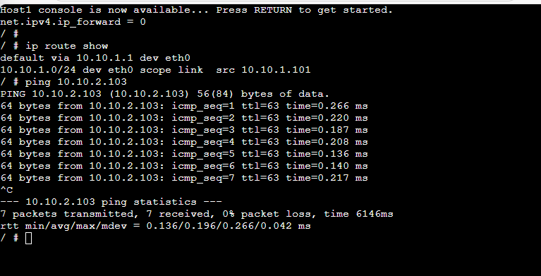

## Observations
- Hosts use a default gateway to reach other networks
- Router forwards packets between subnets
- TTL decreases by 1 → indicates one router hop
- Routing tables contain:
- Directly connected networks
- Default route (hosts only)

# Task 2: Dynamic Routing with OSPF
## Aim
Observe how dynamic routing is set up and handles network changes.
---
## OSPF Topology
- 2 × Hosts
- 4 × Routers (FRR1, FRR2, FRR3, FRR4)
- 2 × NETem links


## Possible paths:

- Top path: Host1 → FRR1 → FRR2 → FRR4 → Host2
- Bottom path: Host1 → FRR1 → FRR3 → FRR4 → Host2

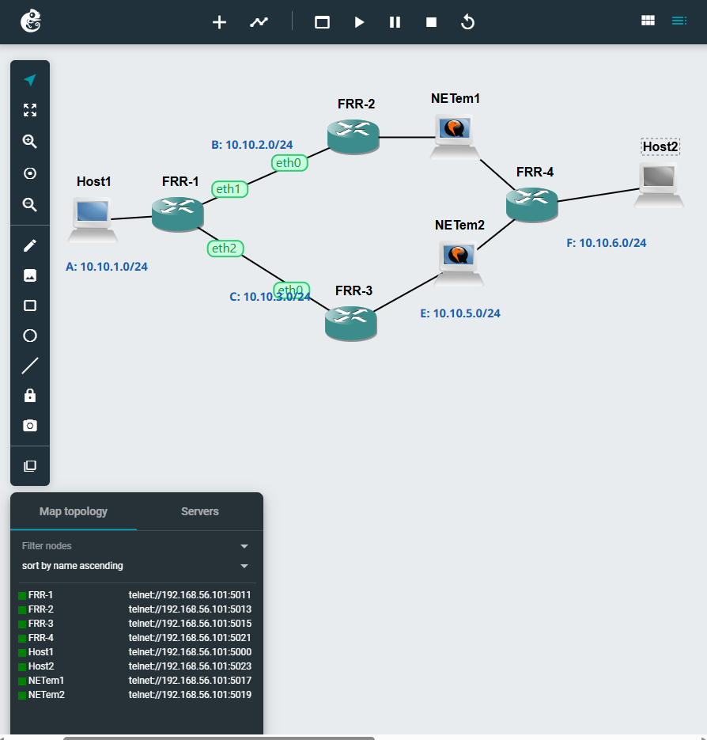


## OSPF Neighbour Information (FRR1)

show ip ospf neighbor

Neighbor ID     Pri State   Dead Time   Address       Interface
10.10.4.2         1 Full    37.398s     10.10.2.2      eth1
10.10.5.3         1 Full    31.217s     10.10.3.3      eth2

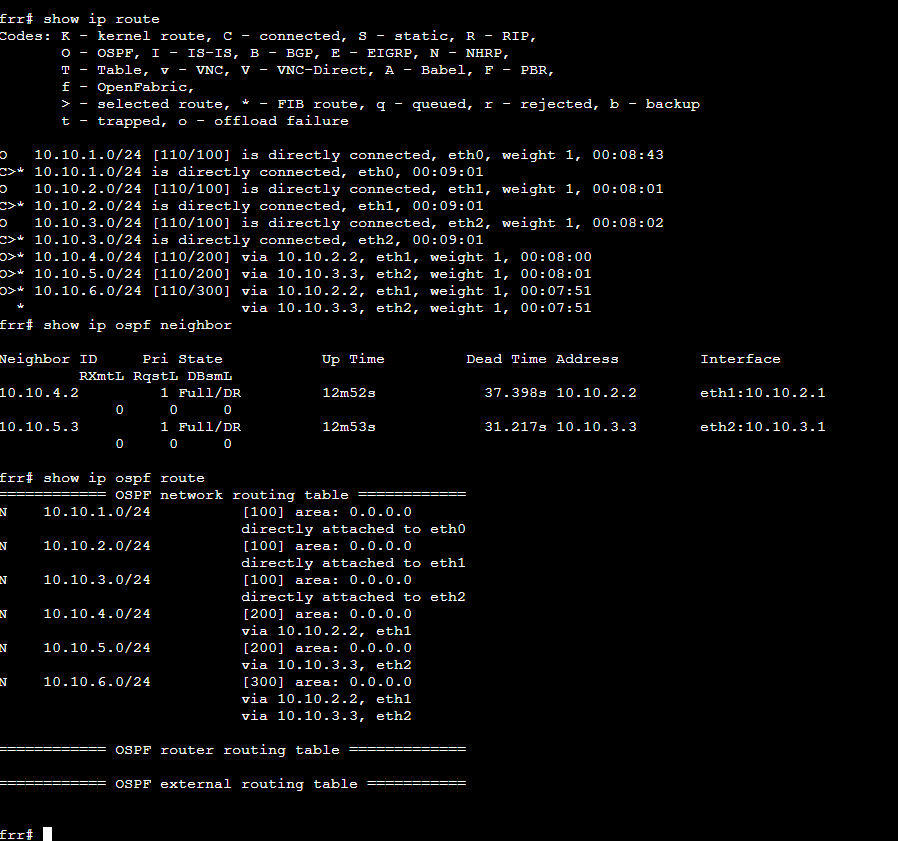

### OSPF Routes

show ip ospf route

N 10.10.1.0/24 [110/2] via 0.0.0.0, eth0
N 10.10.2.0/24 [110/3] via 0.0.0.0, eth1
N 10.10.3.0/24 [110/2] via 0.0.0.0, eth2
N 10.10.4.0/24 [110/3] via 10.10.2.2 eth1
N 10.10.5.0/24 [110/2] via 10.10.3.3, eth2
N 10.10.6.0/24 [110/3] via 10.10.2.2, 10.10.3.3, eth1,eth2

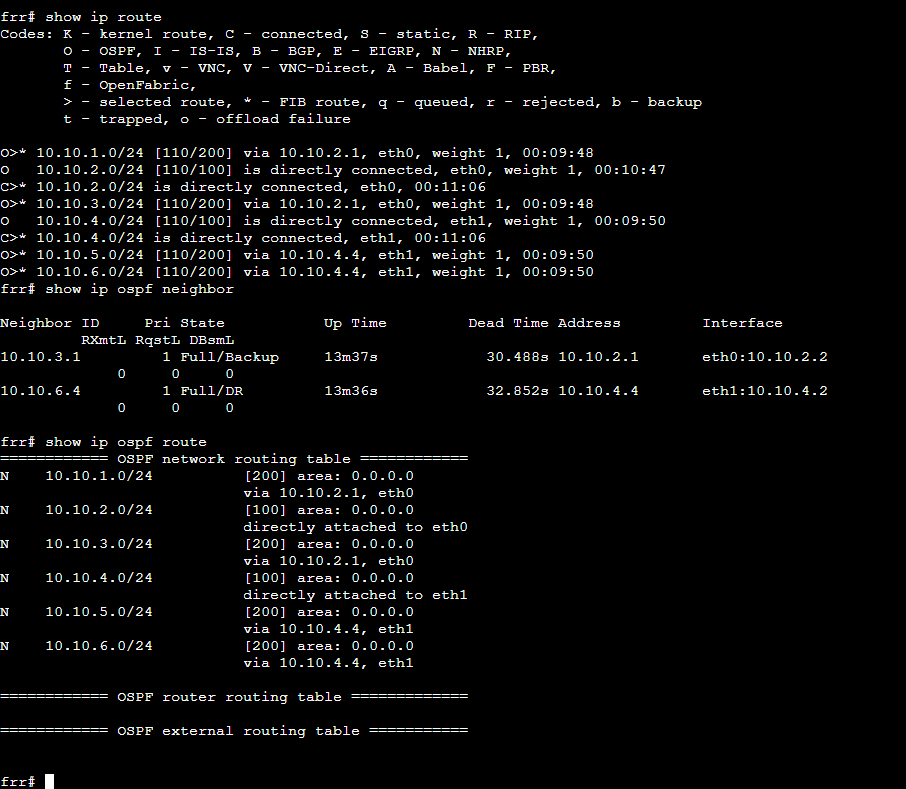

### Routing Table (FRR1)

show ip route

C 10.10.1.0/24 is directly connected
C 10.10.2.0/24 is directly connected
C 10.10.3.0/24 is directly connected
O 10.10.4.0/24 via 10.10.2.2, eth1
O 10.10.5.0/24 via 10.10.3.3, eth2
O 10.10.6.0/24 via 10.10.2.2, eth1
O 10.10.6.0/24 via 10.10.3.3, eth2


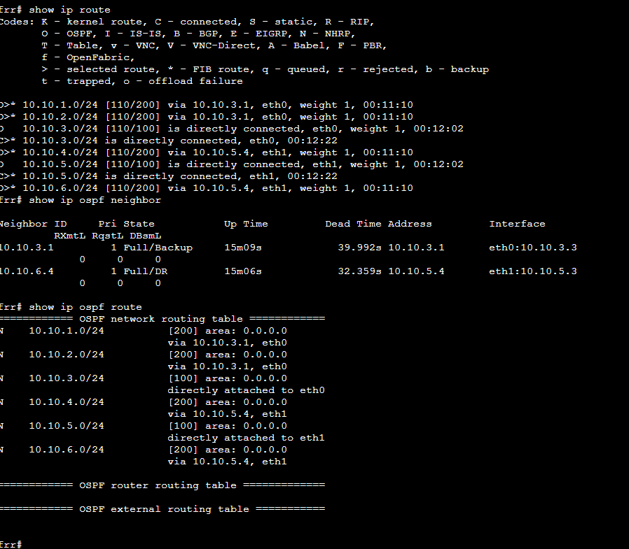

### Routing Summary Table

| Router | Destination | Next Node |
| ------ | ----------- | --------- |
| FRR1   | 0.0.0.0     | FRR2      |
| FRR1   | 10.10.2.1   | FRR3      |
| FRR2   | 10.10.2.1   | FRR4      |
| FRR3   | 0.0.0.0     | FRR4      |
| FRR4   | 10.10.4.4    | FRR2      |

### Traceroute (Before Link Failure)

traceroute <Host2-IP>

1  10.10.1.1 (FRR1)
2  10.10.3.3 (FRR2)
3  10.10.4.4 (FRR4)
4  Host2

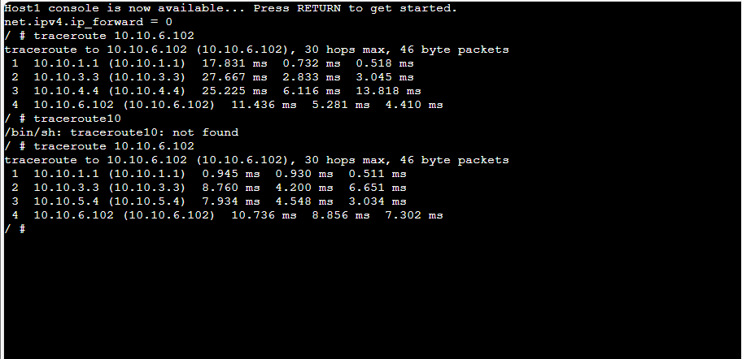

### Link Failure Simulation
- Stopped NETem node
- This disconnects FRR2 ↔ FRR4

### Traceroute (After Link Failure)
1  10.10.6.4 (FRR1)


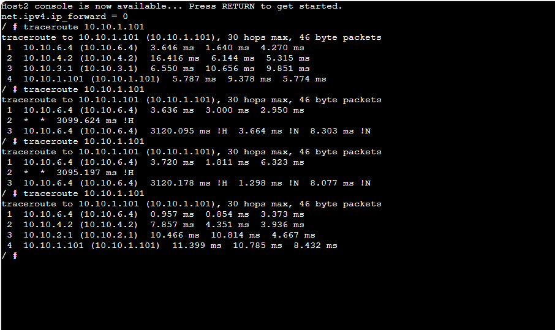

## Observations
- OSPF dynamically updates routes when topology changes
- Traffic reroutes through alternative path
- No manual configuration required after failure
- Demonstrates fault tolerance
## Key Learnings
- Static routing requires manual configuration
- OSPF automatically:
- Discovers routes
- Updates routing tables
- Handles failures
- traceroute shows packet path
- Routing adapts in real-time


## Files Submitted


