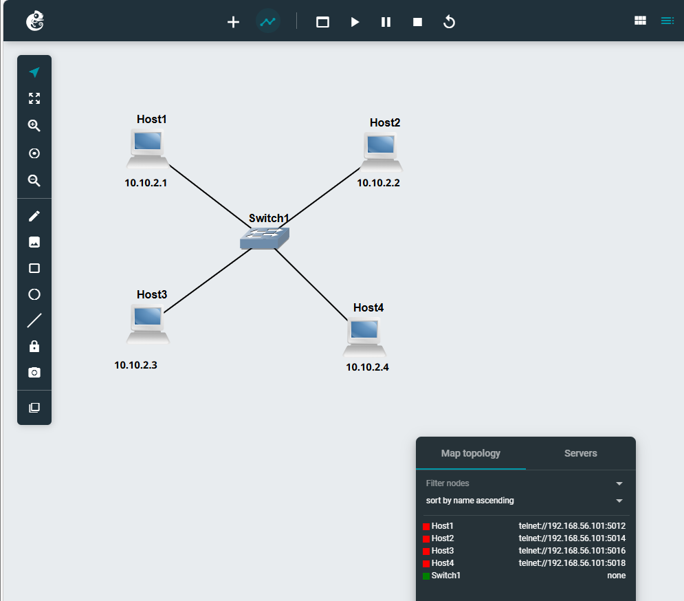
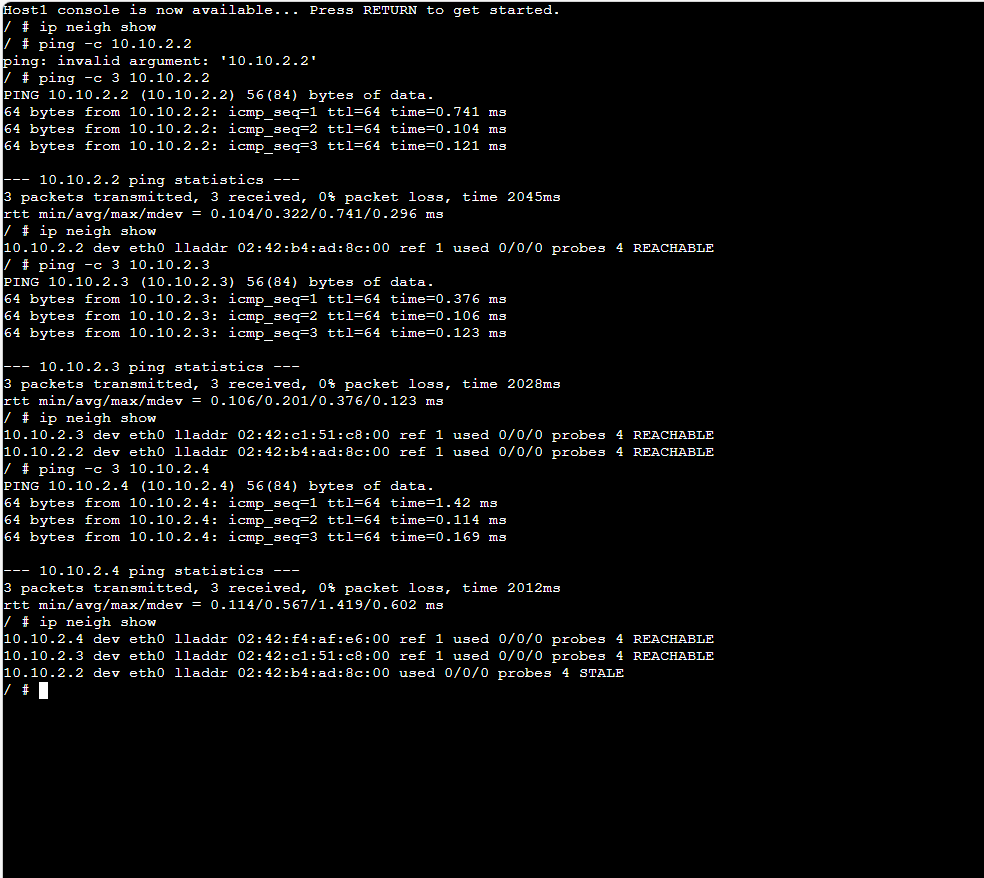
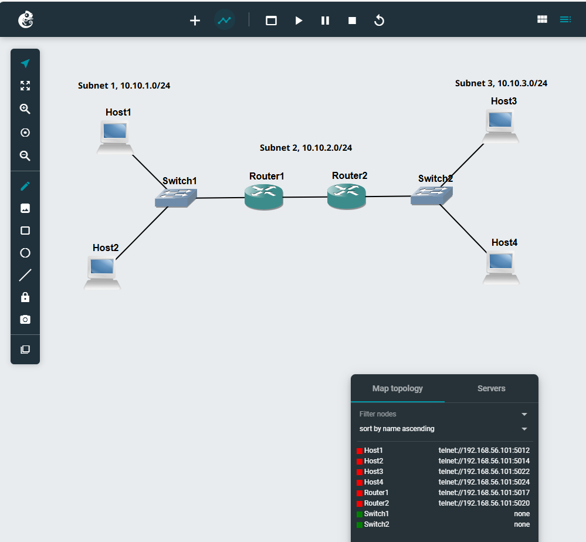
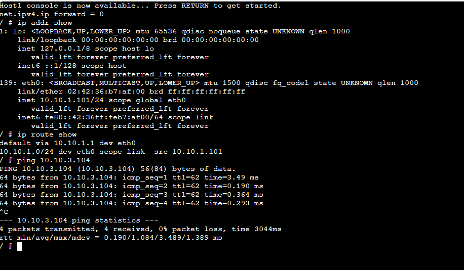
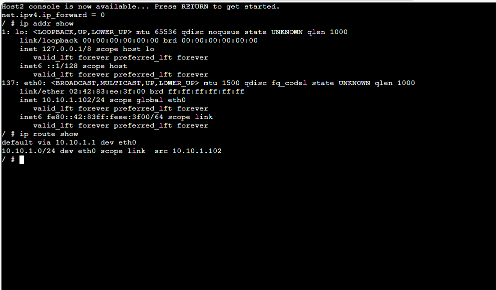
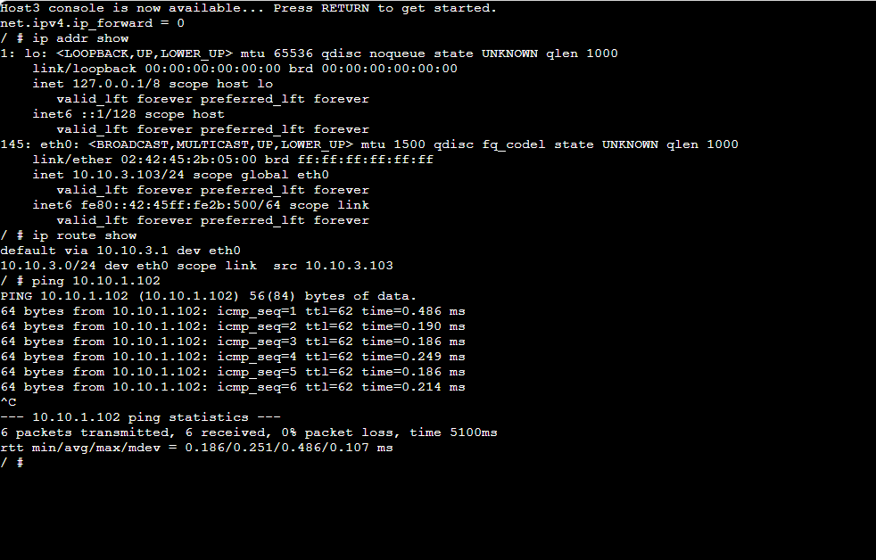
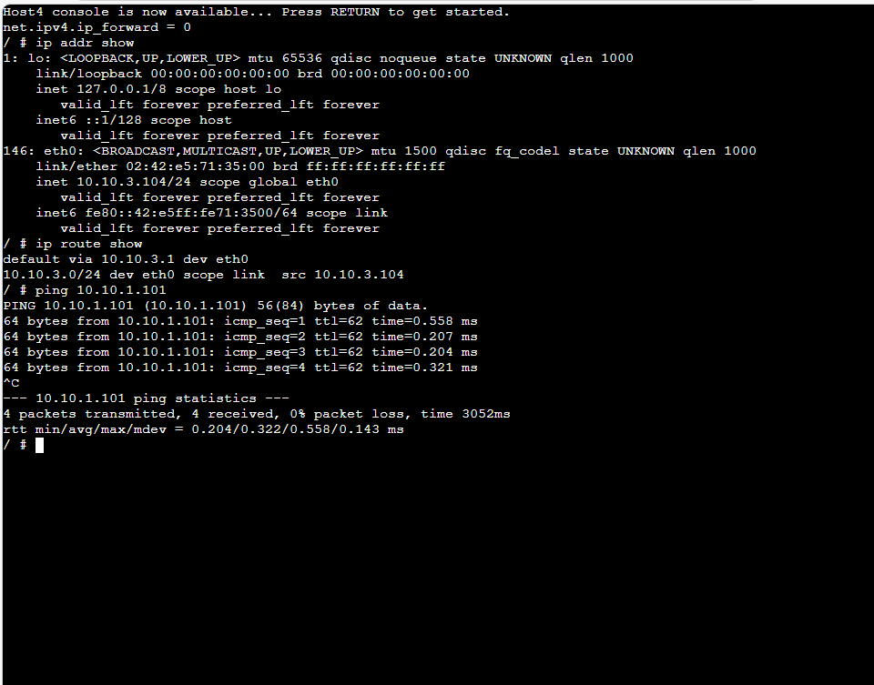
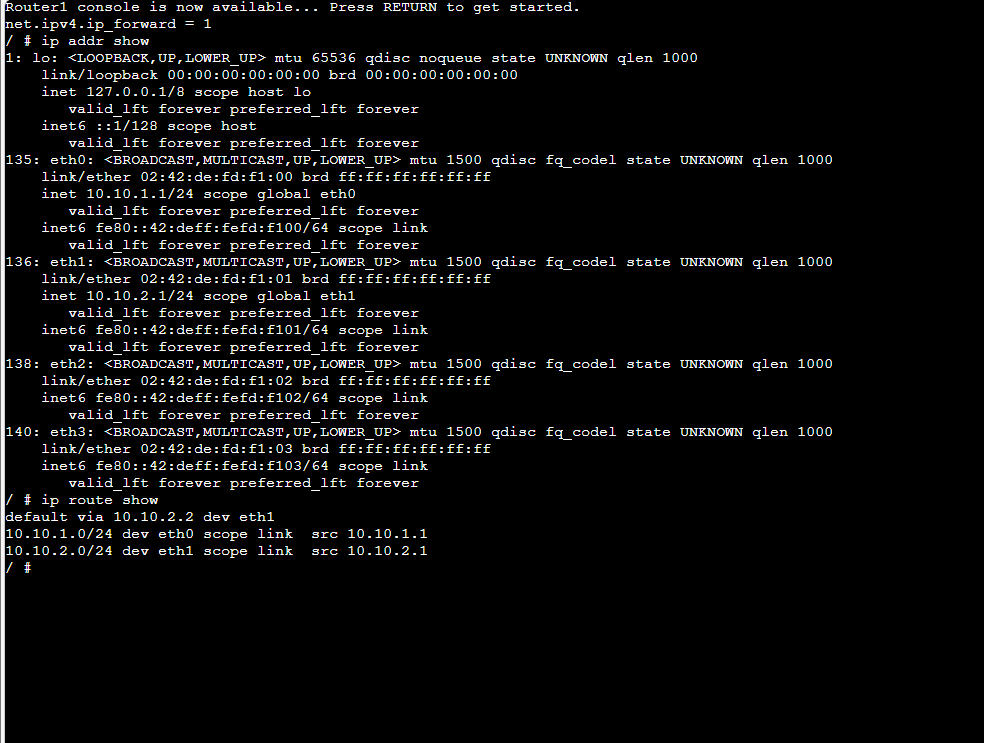
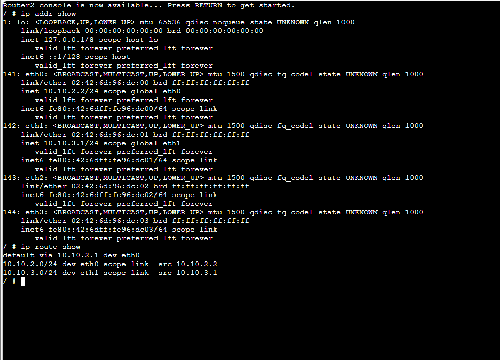

# Week 06 Tutorial - ARP and Default Gateways
---

## Task 1: Resolving IP Addresses to Hardware Addresses (ARP Basics)

### Project Used
- **Project Name:** `Setting-IP-12315332`
  
### Network Topology
- 4 × Linux Hosts (Host A, Host B, Host C, Host D)
- 1 × Ethernet Switch
- All hosts connected to the same switch (same LAN/subnet)
  



### IP Addressing Example
| Host   | IP Address       | Interface |
|--------|------------------|---------|
| Host A | 10.10.2.1/24 | eth0    |
| Host B | 10.10.2.2/24 | eth0    |
| Host C | 10.10.2.3/24 | eth0    |
| Host D | 10.10.2.4/24 | eth0    |

### Activities & Observations

1. **Initial ARP Table on Host A**
   ```bash
   ip neigh show ```
   
- ARP table was mostly empty or contained only the switch/router entry (if any).

2. **Ping from Host A to Host B**
Command: ping -c 3 10.10.2.2
Host A sent an ARP request (broadcast) to resolve Host B’s MAC address.

3. **ARP Table on Host A after pinging Host B**
New entry appeared for Host B’s IP → MAC address mapping.
State: REACHABLE

4. **Ping from Host C to Host A**
Command (on Host C): ping -c 3 10.10.2.3
Host C performed ARP resolution for Host A.

5. **ARP Table on Host A after Host C pinged it**
New entry for Host C’s IP → MAC address was added to Host A’s ARP table.
This shows that ARP entries are populated bidirectionally when communication occurs.


### Key Learnings

ARP (Address Resolution Protocol) dynamically maps IP addresses to MAC (hardware) addresses.
Entries are added automatically when a device needs to communicate with another IP on the same LAN.
ARP table entries have a timeout and can be removed if not used for some time.
The ip neigh show command is used to view the neighbor (ARP) table.

## Outputs - Task 1

- 


# Task 2: Default Gateways
## Project Name

Project: Default-Gateway-<YourStudentID>

## Network Topology

- Subnet 1: Two Linux Hosts + Linux Router 1 + Ethernet Switch
- Subnet 2: Two Linux Hosts + Linux Router 2 + Ethernet Switch
- Subnet 3: Direct link between Router 1 and Router 2

Total Devices: 4 Hosts, 2 Switches, 2 Routers → 3 subnets



## IP Addressing Scheme (Example)
### Subnet 1 (10.10.1.0/24)

- Host A: 10.10.1.101/24  (Gateway: 10.10.1.)
- Host B: 10.10.1.102/24  (Gateway: 10.10.1.1)
- Router 1 (eth0): 10.10.1.1/24
  



### Subnet 2 (10.10.3.0/24)

- Host C: 110.10.3.103/24  (Gateway: 10.10.3.1)
- Host D: 10.10.3.104/24 (Gateway: 10.10.3.1)
- Router 2 (eth0): 10.10.3.0/24




### Subnet 3 (Link between Routers - 10.10.2.0/24)

- Router 1 (eth1): 10.10.1.1/24
- Router 2 (eth1): 10.10.2.2/24




## Configuration (/etc/network/interfaces)
### On Hosts (Forwarding disabled):
```Bash
auto eth0
iface eth0 inet static
    address 10.10.1.101
    netmask 255.255.255.0
    gateway 10.10.1.1
    up sysctl -w net.ipv4.ip_forward=0
```

### On Routers (Forwarding enabled):
```Bash
# Router 1
auto eth0
iface eth0 inet static
    address 10.10.1.1
    netmask 255.255.255.0
    up sysctl -w net.ipv4.ip_forward=1

auto eth1
iface eth1 inet static
    address 10.10.3.1
    netmask 255.255.255.0
```
(Similar configuration for Router 2)

## Routing Tables Verification

- Used ip route show on all devices.
- Hosts showed a default route (default via <gateway>).
- Routers showed connected routes for directly attached subnets.

## Connectivity Test

- Successful ping from Host A (Subnet 1) to Host C (Subnet 2)
  
``` Bash
ping -c 3 10.10.3.103
```
- Traffic path: Host A → Router 1 → Router 2 → Host C


## Outputs - Task 2

## Files included in repository:


- 


   
